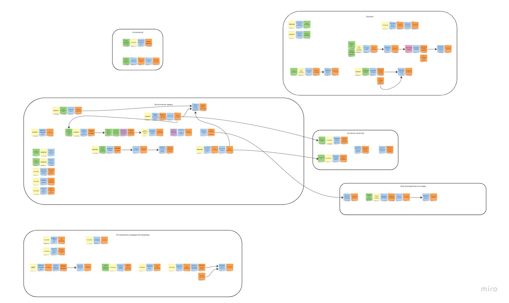

# Описание решений
Подробные схемы доступны на доске: https://miro.com/app/board/uXjVMJQjzJc=/?share_link_id=189655484128

## Event storming модель

## Модель данных

## Модель коммуникаций

## Выбор реализации проекта

Для реализации проекта был выбран монолит с единой БД и разделением на модули. Один инстанс приложения, Одна БД.
В такой конфигурации упрощается начальный выход системы "на рынок", первичный запуск системы (меньше затрат на развертывание, 
проще первичное написание кода, меньше требуется народу на начальной стадии).

При этом рассматривался вариант создания системы на базе микросервисной архитектуры, но по большому счету, малая связанность 
получается только у сервиса тестирования кандидатов. Для остальных сервисов требуется либо организация взаимодействия, для 
получения данных (например API в сервисе Выполнения заявок для получения данных всеми зависимыми сервисами по необходимости), 
либо организация стриминга данных от сервиса Выполнения заявок с организацией обратного канала бизнес-событий.
Оба эти решения создают более сложную архитектуру и требуют больших усилий на начальном этапе.

## Спорные моменты

1. В получившейся модели большое количество событий ушло в модуль выполнения заявок, от чего схема получается трудно понимаемой. 
В начальной версии был отдельный модуль расчета стоимости, но в процессе прорисовки модели данных и связей модулей стало понятно, 
что у модуля расчета стоимости слишком много связей с модулем выполнения заявки.
2. Остается непонятной конструкция модуля алгоритма матчинга, так как она полностью независима с точки зрения разработки, 
но от этого модуля сильно зависит модуль выполнения заявки. В результате, на этой итерации я обозначил модуль как внешний

